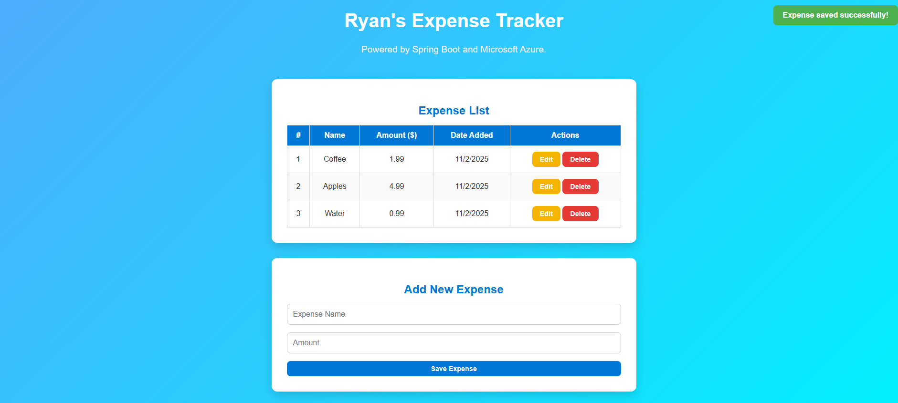

# 💰 Ryan's Expense Tracker (Azure Deployment)

Welcome to my cloud-deployed expense tracking project!  
This application demonstrates how I’ve used **Spring Boot**, **PostgreSQL**, and **Microsoft Azure App Service** to create a full-stack web application that tracks personal expenses with live database updates and a clean, responsive interface.

---

### 🔗 Live Demo
👉 [Visit Expense Tracker](https://ryan-expense-tracker.azurewebsites.net)

---

## 📷 Screenshot


---

## 💡 Features
- Add, edit, and delete expenses in real time  
- Automatic **“Date Added”** tracking for each new entry  
- Deployed on **Microsoft Azure App Service**  
- Backed by **Azure Database for PostgreSQL**  
- Responsive, gradient-themed interface  
- Toast notifications for success and error messages  

---

## ⚙️ Tech Stack
**Frontend:** HTML5, CSS3, Vanilla JavaScript  
**Backend:** Spring Boot 3 (Java 17)  
**Database:** Azure Database for PostgreSQL  
**Build Tool:** Maven  
**Deployment:** Microsoft Azure App Service (CLI deployment)  

---

## 🚀 How It Works
1. The frontend sends CRUD operations (Create, Read, Update, Delete) via REST endpoints.  
2. Spring Boot handles incoming requests, interacts with the PostgreSQL database, and returns JSON responses.  
3. The Azure App Service hosts the Spring Boot JAR, automatically exposing the API and static frontend files.  
4. The database is hosted on **Azure Database for PostgreSQL**, connected securely using environment variables (`DB_PASSWORD`).  
5. Users can add, update, or remove expenses directly from the browser — updates reflect instantly.  

---

## 🧾 Deployment Command
```bash
az webapp deploy --resource-group springboot-rg --name ryan-expense-tracker \
--src-path target/expense-tracker-0.0.1-SNAPSHOT.jar --type jar \
--target-path app.jar --timeout 1200 --clean true
```

## 🏗️ Local Setup
To run this project locally:

```bash
git clone https://github.com/ryanhillman/expense-tracker-azure.git
cd expense-tracker-azure
mvn clean package -DskipTests
java -jar target/expense-tracker-0.0.1-SNAPSHOT.jar
```

---

## 📌 Why This Project?
- Build and deploy Java-based full-stack applications using modern cloud infrastructure.
- Configure and secure Microsoft Azure App Service environments.
- Integrate Spring Boot, PostgreSQL, and Azure Database for PostgreSQL into a seamless deployment pipeline.
- Design clean, responsive UIs that prioritize both usability and technical precision.
